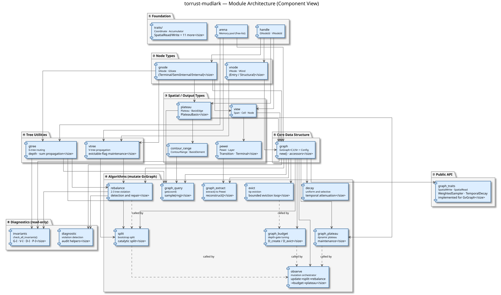
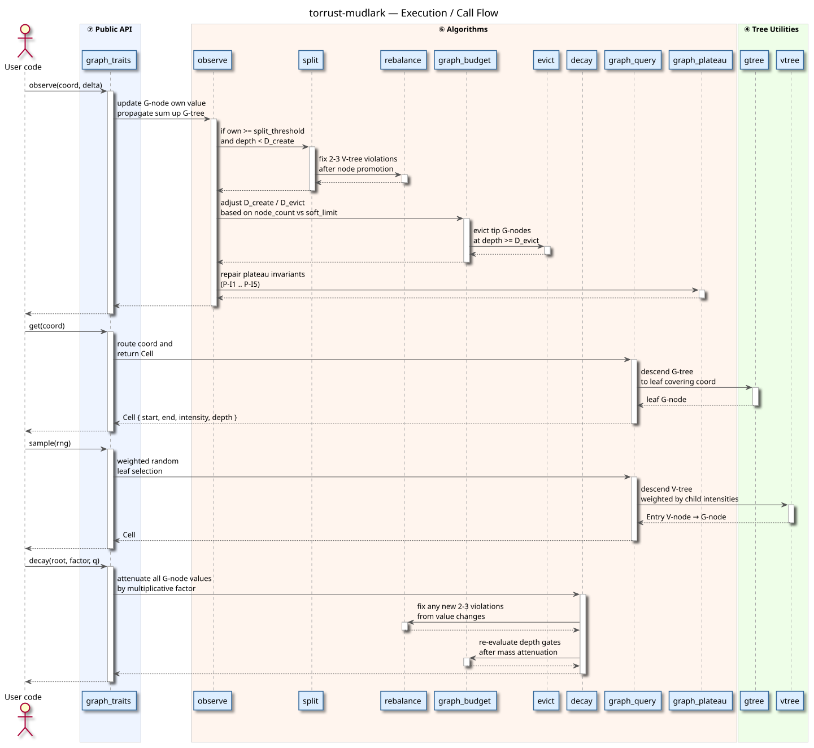

# Architecture

> Source diagrams are in `docs/*.puml`. Regenerate SVGs with:
>
> ```bash
> plantuml -Djava.awt.headless=true -tsvg docs/*.puml
> ```

---

## Component Architecture (module dependency layers)



<details>
<summary>PlantUML source — component-architecture.puml</summary>

See [component-architecture.puml](component-architecture.puml).

</details>

---

## Execution / Call Flow



<details>
<summary>PlantUML source — call-flow.puml</summary>

See [call-flow.puml](call-flow.puml).

</details>
