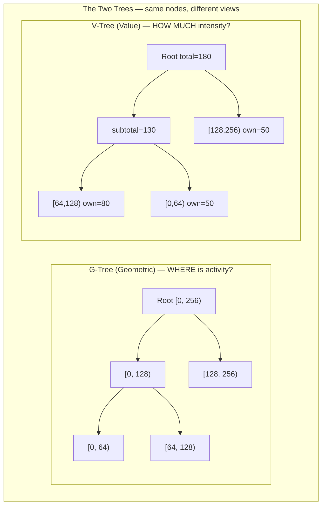
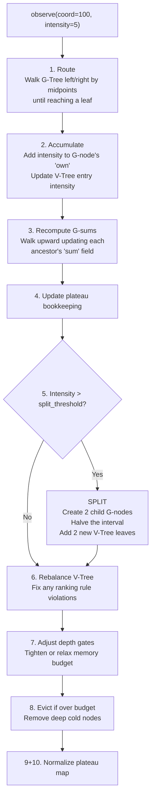
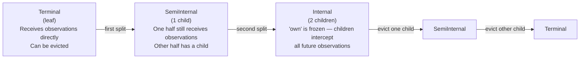
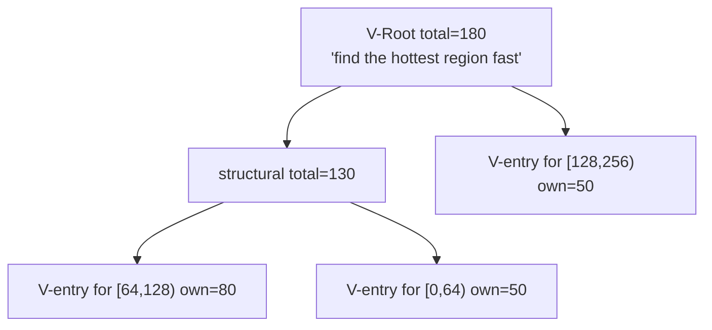

# What is `torrust-mudlark`?

> A loose explainer for software engineers with general knowledge of common data structures
> (BTrees, HashMaps, Bloom filters, etc.) but no specialisation in spatial indexes.

---

## 1. What is it for?

Imagine you're running a BitTorrent **tracker** receiving millions of events per hour: `event=started` announces (peers joining a swarm), periodic re-announces, `event=completed` transitions, and scrape requests — each tied to a coordinate (a prefix of an infohash, a port number, an IP prefix, a timestamp bin). You want to answer questions like these:

**Generic (any streaming coordinate space):**

- **"Which region of my coordinate space is hottest right now?"**
- **"What's the total activity in the range [100, 200]?"**
- **"Has activity in any region changed anomalously in the last 5 minutes?"**
- **"Give me a random coordinate, weighted by how active it is."**

**Concrete examples for a BitTorrent tracker or index:**

- **"Which infohash prefix bucket is receiving the most announces right now?"** — useful for spotting a swarm explosion or a coordinated flood.
- **"Give me a random active infohash, weighted by swarm size."** — fair, activity-proportional sampling for health checks or auditing.
- **"What fraction of total announce traffic is in the IP range 10.0.0.0/8 ?"** — geographic or ISP traffic breakdown.
- **"Has any port range gone from cold to hot in the last minute?"** — early warning for port-scan patterns or botnet activity.
- **"What is the total announce rate across all infohashes in the range [0x00, 0x0F]?"** — bucket-level rate queries without iterating every infohash.
- **"Which time bin saw a spike in `event=completed` transitions this hour?"** — completion-rate anomaly detection.

A plain `HashMap<coord, count>` works if coordinates are discrete and few. A sorted tree handles range queries. But neither **adapts its resolution to the data** — they treat every coordinate equally regardless of whether it is hot or cold.

`mudlark` is a **streaming, self-adapting spatial index**: it automatically zooms in on busy regions (finer resolution where needed) and zooms out on quiet regions (coarser resolution, less memory). It also supports:

> **What "streaming" means here:** mudlark processes events _one at a time, as
> they arrive_, without buffering them or waiting to see the full dataset. Each
> call to `observe()` updates the structure immediately and the raw event is
> discarded — only the aggregated state is kept. This is the opposite of a
> _batch_ approach (e.g. computing a histogram over a day's log file after the
> fact). The term comes from the **streaming algorithms** field, which studies
> data structures that maintain a compact summary in a single pass — HyperLogLog
> (cardinality) and Count-Min sketch (top-K frequency) are well-known examples
> from that family. mudlark is in that tradition: a bounded, always-current
> summary of the intensity distribution, with no raw event storage.

- **Temporal decay** — old events matter less over time.
- **Memory budget** — cap yourself to N nodes; evict the least-important detail automatically.
- **Weighted sampling** — pick a random coordinate proportional to how active it is.

**Planned concrete use:** the base layer for `torrust-sentinel`, an anomaly detector that watches torrent tracker activity in real time.

### Problems that motivated mudlark

See [USE_CASES.md](USE_CASES.md) for a detailed breakdown of the four concrete
problems that drove the design, together with an assessment of how well mudlark
fits each one. In short:

| #   | Problem                                                               | Fit                                                                                                    |
| --- | --------------------------------------------------------------------- | ------------------------------------------------------------------------------------------------------ |
| 1   | Malformed UDP announces — IP-prefix rate limiting that scales to IPv6 | ✅ good                                                                                                |
| 2   | Password-reset flooding from the same IP block                        | ✅ good                                                                                                |
| 3   | Password-reset flooding keyed by email domain (botnet, many IPs)      | ⚠️ depends on encoding — hashing breaks it; reverse-domain big-endian works for namespace-wide attacks |
| 4   | Fake-torrent DDoS via bit-adjacent infohash clustering                | ✅ excellent                                                                                           |

The common thread: **the signal is in the shape of the distribution, not in any
individual value.** mudlark makes that shape visible and queryable at low cost.

---

## 2. Key terms

The terms below have precise meanings inside `mudlark` that sometimes differ from everyday usage. Each term is defined — and the reasoning behind its name explained — in the standalone [GLOSSARY.md](GLOSSARY.md).

| Term              | One-line reminder                                                                    |
| ----------------- | ------------------------------------------------------------------------------------ |
| **coordinate**    | Position on the 1D key axis (the _where_). Not a measured value; not a config param. |
| **intensity**     | Weight of one observation (the _how much_).                                          |
| **`own`**         | Intensity accumulated directly at a G-node; frozen once children exist.              |
| **`sum`**         | `own` plus all descendants' sums; keeps growing after `own` is frozen.               |
| **G-node**        | A node in the G-Tree, covering a dyadic interval `[start, end)`.                     |
| **G-Tree**        | The binary spatial tree; partitions `[0, 2^N)` by repeated halving.                  |
| **V-entry**       | A G-node's seat in the V-Tree tournament bracket; tracks its `own` intensity.        |
| **V-Tree**        | The tournament bracket; orders G-nodes by intensity for fast sampling.               |
| **terminal**      | G-node with no children (leaf). Receives observations; eviction candidate.           |
| **semi-internal** | G-node with one child. One half handled by child, other half still direct.           |
| **internal**      | G-node with two children. `own` is frozen; all observations bypass it.               |
| **plateau**       | Maximal contiguous coordinate span where all covering G-nodes share the same depth.  |
| **split**         | Creating children for a terminal node when `own` exceeds `split_threshold`.          |
| **eviction**      | Removing a terminal G-node and absorbing its `own` into its parent.                  |
| **decay**         | Multiplying all intensities by a factor ≤ 1 to forget old history.                   |
| **PEWEI**         | Significance-ordered export format produced by `extract()`.                          |

---

## 3. Overall architecture

At its core mudlark maintains **two interlocking trees over the same set of nodes** — hence "Dual-Tree". Think of it like a database that has both a spatial B-tree index AND a priority queue pointing at the same rows simultaneously.



The **G-Tree** (Geometric Tree) is a binary spatial tree — like a 1D segment tree. Each node covers a half-interval. It answers: _where is activity distributed?_

The **V-Tree** (Value Tree) is a tournament bracket — the highest-intensity node bubbles toward the root. It answers: _where is the hottest activity, and how fast can I reach it?_

Both trees reference the exact same G-nodes. The trees are two views over the same data.

---

## 4. The domain: power-of-2 coordinate space

The entire coordinate space is `[0, 2^N)` where `N` is a compile-time parameter. E.g. `N=8` → `[0, 256)`. Every split is exactly in half:

```
Depth 0:  [         0 ............. 256         )
Depth 1:  [  0 ... 128 )    [  128 ... 256  )
Depth 2:  [0..64)[64..128)  [128..192)[192..256)
```

Each G-node stores:

- **`own`** — intensity accumulated directly at this node (frozen once children exist)
- **`sum`** — `own` + all descendants' sums (total intensity under this region)

---

## 5. What happens on `observe(coord, intensity)`

Every incoming event triggers a 10-step journey:



**Step 1 (Routing):** Walk the G-Tree using midpoints. Coordinate 100 in `[0,256)`: 100 < 128 → left to `[0,128)`. 100 ≥ 64 → right to `[64,128)`. That leaf receives the intensity.

**Step 5 (Split):** When a region accumulates enough, split it in half. `[64,128)` → `[64,96)` + `[96,128)`. This is how the index zooms in on hot spots automatically.

**Step 8 (Evict):** When over the memory budget, the deepest and coldest leaves are absorbed back into their parents. The index shrinks from the tips inward.

---

## 6. The three G-node states

A G-node lives through a lifecycle:



- **Terminal**: a leaf. Accumulates directly. Can rise or fall in the V-Tree tournament.
- **SemiInternal**: one child created so far. The uncovered half still acts as a receiver.
- **Internal**: both children exist. Its `own` value is permanently frozen — a historical record of what arrived before it was split. Future observations bypass it entirely.

The key insight: **an internal node's `own` is frozen history; its `sum` keeps growing** as descendants accumulate. The G-Tree sees it as increasingly important (large `sum`); the V-Tree sees it as increasingly irrelevant (frozen `own`).

---

## 7. The V-Tree: the tournament bracket

The V-Tree is a max-heap-like tournament bracket. Every G-node has a "seat" (V-entry) in the tournament. Structural nodes are pure scaffolding — they hold no data themselves.



**The key rule — max-uncle constraint:** _a node's intensity cannot exceed the maximum of its uncles' intensities._ An "uncle" is a sibling of your parent. This keeps the bracket stable: you can only sit near the top if you're genuinely intense relative to your neighbourhood.

**Payoff — O(log N) weighted sampling:** to pick a random coordinate proportional to intensity, walk from the V-root down to a leaf, at each step picking a child with probability proportional to its cached intensity. Provably within factor 1.44 of optimal (Shannon entropy bound).

---

## 8. How the two trees protect each other

The two trees are co-dependent. Each enforces a constraint the other relies on:

| Direction           | Protection                                                     | Mechanism                                |
| ------------------- | -------------------------------------------------------------- | ---------------------------------------- |
| V-Tree → downward   | Children can't be shuffled away while parent is a strong uncle | Max-uncle constraint                     |
| G-Tree → upward     | Parent's `own` stays frozen once children exist                | Observation routing (children intercept) |
| G-Tree → structural | Only leaf nodes with no children can be evicted                | Dependents check                         |

Remove any one shield and the system breaks: without routing interception the parent's value keeps growing and nothing can ever outrank it; without the uncle constraint the bracket thrashes on every update; without the dependents check eviction could destroy a node that other nodes depend on.

---

## 9. Decay: forgetting old history

`decay(attenuation, q)` multiplies all intensities by a factor ≤ 1:

- **Uniform (q=0):** every node scaled equally — `own × attenuation` throughout. Like dividing the whole histogram by a constant.
- **Selective (q>0):** deeper (finer) nodes are scaled more aggressively. Recent fine-grain detail fades faster than coarse-grain history. Implements a recency bias.

After decay, any V-Tree ranking violations caused by the intensity changes are fixed by a rebalance pass.

---

## 10. Plateaus: the zoom-level map

A **plateau** is a maximal contiguous region of the domain where all covering G-nodes are at the same depth.

```
Example — two plateaus after some splits:

Coord:  0         64        128               256
        [  depth 2  ][  depth 2  ][   depth 1   ]
         ← plateau A →← plateau A →← plateau B →
```

Plateaus give you a "resolution map" of the index: depth 1 means coarse coverage, depth 4 means fine coverage. The `contour_range(start, end)` query returns the minimal set of G-nodes that tiles a given range — useful for computing anomaly scores over arbitrary intervals.

---

## 11. Memory budget and eviction

Configuration:

- **`budget`** — max number of G-nodes allowed.
- **`depth_evict`** — nodes deeper than this level are eligible for eviction.
- **`depth_create`** — splits are blocked above this depth (no point creating nodes that will be immediately evicted).
- **`depth_buffer`** — the safety gap between `depth_create` and `depth_evict`.

When the node count exceeds the soft limit, `depth_evict` is tightened by 1 each observation cycle. When the count drops below `alpha_relax × budget`, it is relaxed by 1. This is a continuous adaptive feedback loop — the index breathes in and out.

Eviction removes a leaf G-node, absorbs its `own` into its parent, removes its V-Tree entry, and triggers a rebalance pass to fix any ranking violations the removal created.

---

## 12. The public API at a glance

| Method                      | What it does                                                                                   |
| --------------------------- | ---------------------------------------------------------------------------------------------- |
| `observe(coord, intensity)` | The write path — route, accumulate, split, rebalance, evict                                    |
| `get(coord)`                | Point query — which cell covers this coordinate? Returns `Cell {start, end, intensity, depth}` |
| `sample(&mut rng)`          | Weighted random sample — proportional to intensity, O(log N)                                   |
| `range_sum(range)`          | Total intensity in an arbitrary coordinate range                                               |
| `contour_range(start, end)` | Minimal G-node cover of a range (for anomaly scoring)                                          |
| `decay(attenuation, q)`     | Scale all intensities down (sliding time window)                                               |
| `extract()`                 | Export a PEWEI snapshot — significance-ordered layers for external analysis                    |
| `check_evictions()`         | Manually trigger eviction scan (called automatically inside `observe` too)                     |
| `plateaus()`                | Return the current resolution map (BTreeMap of depth intervals)                                |

---

## 13. Config knobs

```rust
Config {
    split_threshold: 10u64,  // intensity needed to earn a split
    depth_create: 2,          // max depth at which splits are created
    depth_evict: 5,           // nodes deeper than this are eviction candidates
    budget: Some(128),        // max G-nodes (None = unlimited)
    alpha_relax: 0.5,         // relax eviction gate when count < 50% of budget
    bounded_eviction: true,   // limit evictions per observe() call
}
```

---

## 14. One-sentence summary

> Mudlark is a self-resizing adaptive histogram that automatically allocates finer resolution to hot regions of a coordinate space, supports weighted random sampling, range queries, memory budgeting, and temporal decay — all in a single streaming data structure with no external storage.
